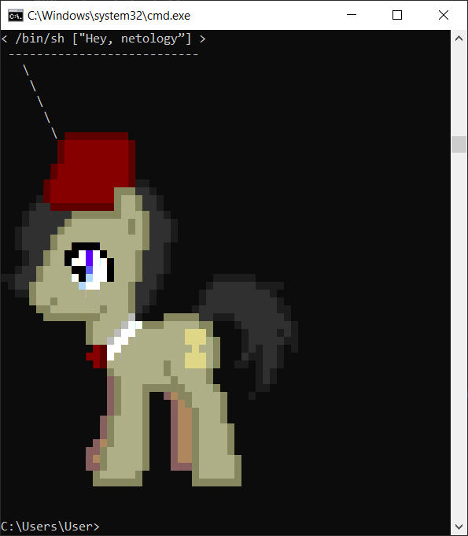
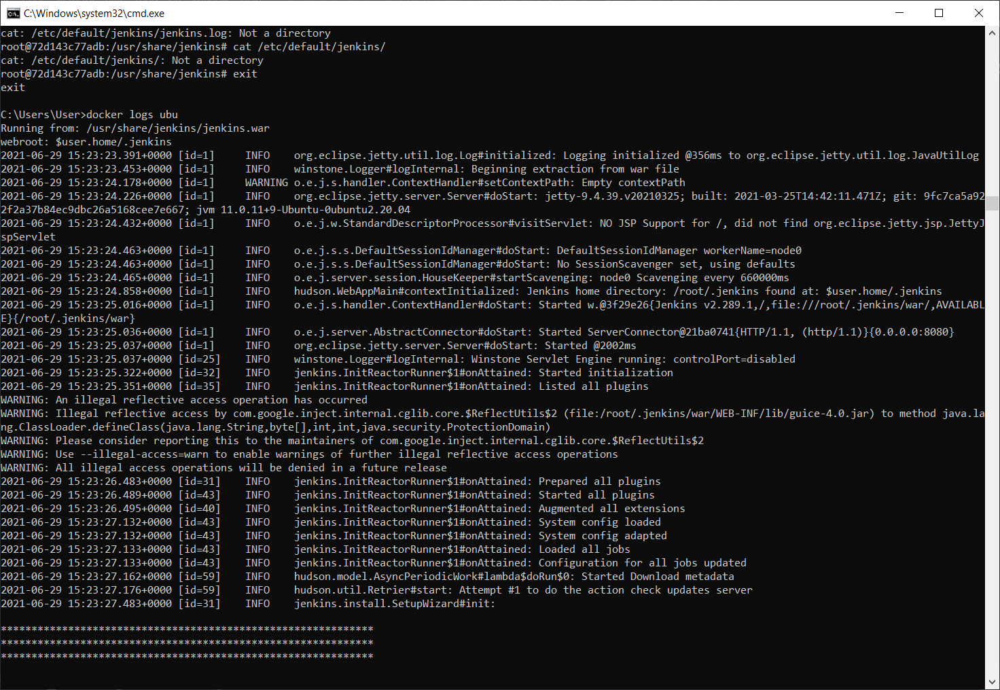
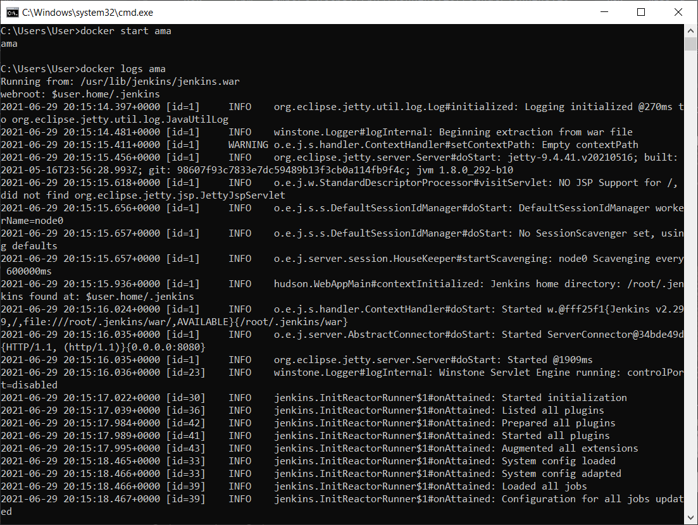
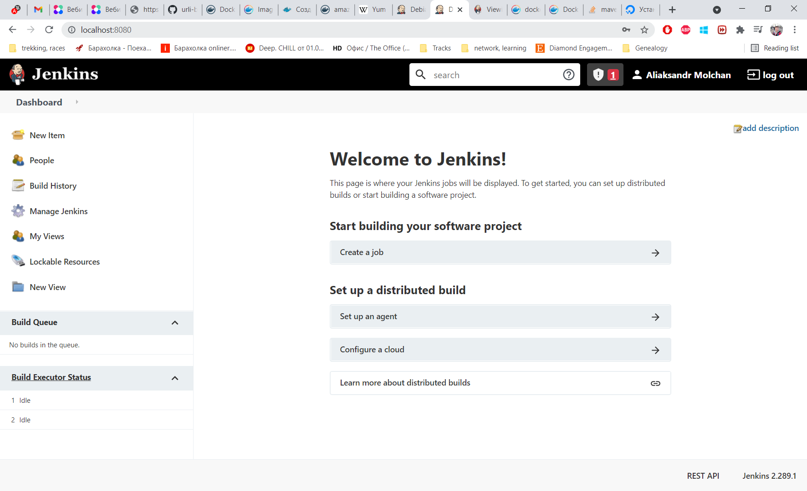
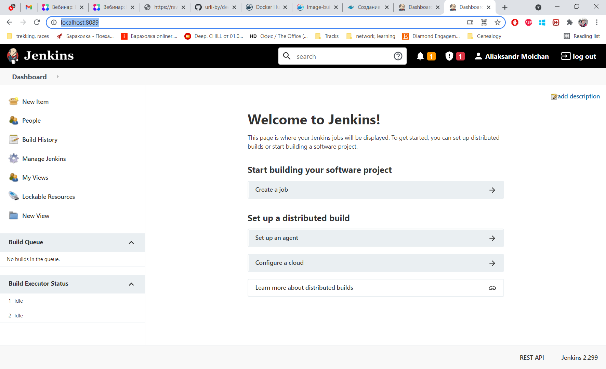
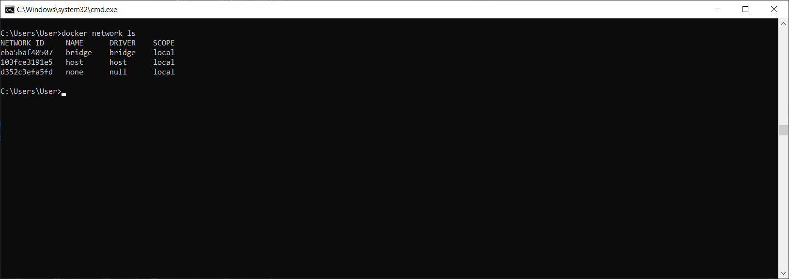
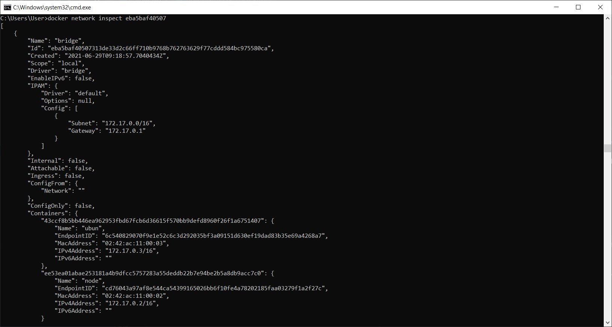
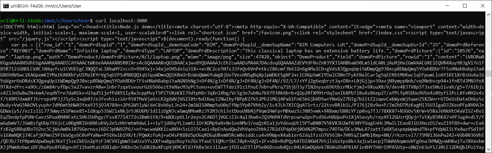
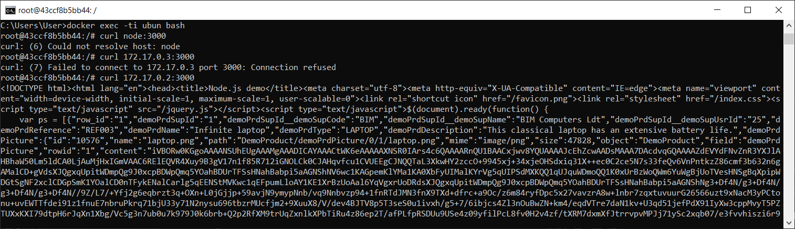

# Домашнее задание к занятию "5.4. Практические навыки работы с Docker"

## Задача 1 

В данном задании вы научитесь изменять существующие Dockerfile, адаптируя их под нужный инфраструктурный стек.

Измените базовый образ предложенного Dockerfile на Arch Linux c сохранением его функциональности.

```text
FROM ubuntu:latest

RUN apt-get update && \
    apt-get install -y software-properties-common && \
    add-apt-repository ppa:vincent-c/ponysay && \
    apt-get update
 
RUN apt-get install -y ponysay

ENTRYPOINT ["/usr/bin/ponysay"]
CMD ["Hey, netology”]
```

Для получения зачета, вам необходимо предоставить:
- Написанный вами Dockerfile
  
```text
FROM archlinux:latest

RUN pacman -Syu --noconfirm
RUN	pacman -S --noconfirm ponysay 

ENTRYPOINT ["/usr/bin/ponysay"]
CMD ["Hey, netology”]
```
- Скриншот вывода командной строки после запуска контейнера из вашего базового образа

- Ссылку на образ в вашем хранилище docker-hub

[arch_linux](https://hub.docker.com/repository/docker/urliby/arch_linux)


## Задача 2 

В данной задаче вы составите несколько разных Dockerfile для проекта Jenkins, опубликуем образ в `dockerhub.io` и посмотрим логи этих контейнеров.

- Составьте 2 Dockerfile:

    - Общие моменты:
        - Образ должен запускать [Jenkins server](https://www.jenkins.io/download/)
        
    - Спецификация первого образа:
        - Базовый образ - [amazoncorreto](https://hub.docker.com/_/amazoncorretto)
        - Присвоить образу тэг `ver1` 
    
    - Спецификация второго образа:
        - Базовый образ - [ubuntu:latest](https://hub.docker.com/_/ubuntu)
        - Присвоить образу тэг `ver2` 

- Соберите 2 образа по полученным Dockerfile
- Запустите и проверьте их работоспособность
- Опубликуйте образы в своём dockerhub.io хранилище

Для получения зачета, вам необходимо предоставить:
- Наполнения 2х Dockerfile из задания
  
```text
FROM amazoncorretto:latest

RUN		yum update && yum install -y wget
RUN		wget -O /etc/yum.repos.d/jenkins.repo https://pkg.jenkins.io/redhat/jenkins.repo
RUN		rpm --import https://pkg.jenkins.io/redhat/jenkins.io.key
RUN		yum upgrade
RUN		yum install -y jenkins java-8-openjdk-devel
EXPOSE  8089
WORKDIR /usr/share/jenkins/
CMD     ["java", "-jar", "/usr/lib/jenkins/jenkins.war"]
```
```text
FROM    ubuntu:latest
RUN     apt-get update && apt-get install -y wget sudo gnupg
RUN     wget -q -O - https://pkg.jenkins.io/debian-stable/jenkins.io.key | sudo apt-key add -
RUN     echo "deb https://pkg.jenkins.io/debian-stable binary/" >> /etc/apt/sources.list
RUN     apt-get update && apt-get install -y openjdk-11-jdk jenkins
EXPOSE  8080
WORKDIR /usr/share/jenkins/
CMD     ["java", "-jar", "/usr/share/jenkins/jenkins.war"]
```
- Скриншоты логов запущенных вами контейнеров (из командной строки)

  
- Скриншоты веб-интерфейса Jenkins запущенных вами контейнеров (достаточно 1 скриншота на контейнер)

  
  
- Ссылки на образы в вашем хранилище docker-hub

[mazoncorretto:ver1](https://hub.docker.com/repository/docker/urliby/amazoncorretto)

[ubuntu:ver2](https://hub.docker.com/repository/docker/urliby/ubuntu)
  
***PS. Ubuntu очень медленно пушится. Ставил на ночь и пока что только половина прогресса.
но со временем ссылка станет активной )***

## Задача 3 

В данном задании вы научитесь:
- объединять контейнеры в единую сеть
- исполнять команды "изнутри" контейнера

Для выполнения задания вам нужно:
- Написать Dockerfile: 
    - Использовать образ https://hub.docker.com/_/node как базовый
    - Установить необходимые зависимые библиотеки для запуска npm приложения https://github.com/simplicitesoftware/nodejs-demo
    - Выставить у приложения (и контейнера) порт 3000 для прослушки входящих запросов  
    - Соберите образ и запустите контейнер в фоновом режиме с публикацией порта

- Запустить второй контейнер из образа ubuntu:latest 
- Создайть `docker network` и добавьте в нее оба запущенных контейнера
- Используя `docker exec` запустить командную строку контейнера `ubuntu` в интерактивном режиме
- Используя утилиту `curl` вызвать путь `/` контейнера с npm приложением  

Для получения зачета, вам необходимо предоставить:
- Наполнение Dockerfile с npm приложением
  
```text
FROM    node:latest
WORKDIR /docker/node/
RUN     apt-get update
RUN     git clone https://github.com/simplicitesoftware/nodejs-demo.git
WORKDIR /docker/node/nodejs-demo/
RUN     npm install -y
EXPOSE  3000
ENTRYPOINT      ["npm", "start", "0.0.0.0"]

```
- Скриншот вывода вызова команды списка docker сетей (docker network cli)

  ***Вот тут немного непонятно, докер же по умолчанию создает мост и все контейнеры добавляет в него. 
  То есть я не создавая отдельных сетей вижу мост и если его чекнуть, можно увидеть, что два контейнера уже находятся в одной подсети***
  
  ***Соответственно, они видят друг друга и могут обмениваться сообщениями
  Также на хосте доступно приложение на 3000 порту***
- Скриншот вызова утилиты curl с успешным ответом





---

### Как оформить ДЗ?

Выполненное домашнее задание пришлите ссылкой на .md-файл в вашем репозитории.

---