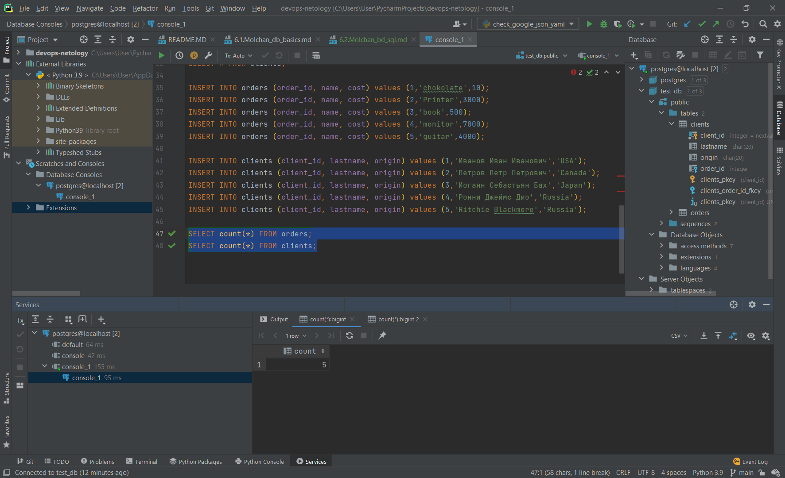

# Домашнее задание к занятию "6.2. SQL"

## Введение

Перед выполнением задания вы можете ознакомиться с 
[дополнительными материалами](https://github.com/netology-code/virt-homeworks/tree/master/additional/README.md).

## Задача 1

Используя docker поднимите инстанс PostgreSQL (версию 12) c 2 volume, 
в который будут складываться данные БД и бэкапы.

Приведите получившуюся команду или docker-compose манифест.

```dockerfile
FROM    postgres:12
VOLUME	/postgre_backup
VOLUME	/postgre_db
ENV POSTGRES_PASSWORD=mysecretpassword
ENV PGDATA /postgre_db
RUN     apt-get update
EXPOSE  5432
```
```commandline
docker run --name postgre -v /postgre_db:postgre_db -ti -p 5432:5432 postgre
```
## Задача 2

В БД из задачи 1: 
- создайте пользователя test-admin-user и БД test_db
- в БД test_db создайте таблицу orders и clients (спeцификация таблиц ниже)
- предоставьте привилегии на все операции пользователю test-admin-user на таблицы БД test_db
- создайте пользователя test-simple-user  
- предоставьте пользователю test-simple-user права на SELECT/INSERT/UPDATE/DELETE данных таблиц БД test_db

Таблица orders:
- id (serial primary key)
- наименование (string)
- цена (integer)

Таблица clients:
- id (serial primary key)
- фамилия (string)
- страна проживания (string, index)
- заказ (foreign key orders)

Приведите:
- итоговый список БД после выполнения пунктов выше,
```commandline
postgres=# \l
                                 List of databases
   Name    |  Owner   | Encoding |  Collate   |   Ctype    |   Access privileges
-----------+----------+----------+------------+------------+-----------------------
 postgres  | postgres | UTF8     | en_US.utf8 | en_US.utf8 |
 template0 | postgres | UTF8     | en_US.utf8 | en_US.utf8 | =c/postgres          +
           |          |          |            |            | postgres=CTc/postgres
 template1 | postgres | UTF8     | en_US.utf8 | en_US.utf8 | =c/postgres          +
           |          |          |            |            | postgres=CTc/postgres
 test_db   | postgres | UTF8     | en_US.utf8 | en_US.utf8 |
(4 rows)
```

- описание таблиц (describe)
  
```commandline
test_db=# \d orders
                                   Table "public.orders"
  Column  |     Type     | Collation | Nullable |                 Default
----------+--------------+-----------+----------+------------------------------------------
 order_id | integer      |           | not null | nextval('orders_order_id_seq'::regclass)
 name     | character(1) |           |          |
 cost     | integer      |           |          |
Indexes:
    "orders_pkey" PRIMARY KEY, btree (order_id)
Referenced by:
    TABLE "clients" CONSTRAINT "clients_order_id_fkey" FOREIGN KEY (order_id) REFERENCES orders(order_id)

test_db=# \d clients
                                    Table "public.clients"
  Column   |     Type     | Collation | Nullable |                  Default
-----------+--------------+-----------+----------+--------------------------------------------
 client_id | integer      |           | not null | nextval('clients_client_id_seq'::regclass)
 lastname  | character(1) |           |          |
 origin    | character(1) |           |          |
 order_id  | integer      |           |          |
Indexes:
    "clients_pkey" PRIMARY KEY, btree (client_id)
Foreign-key constraints:
    "clients_order_id_fkey" FOREIGN KEY (order_id) REFERENCES orders(order_id)
```
- SQL-запрос для выдачи списка пользователей с правами над таблицами test_db

```postgresql
SELECT grantee, privilege_type
FROM information_schema.role_table_grants
WHERE table_name='orders'
```
- список пользователей с правами над таблицами test_db
```commandline
postgres=# \du+
                                              List of roles
    Role name     |                         Attributes                         | Member of | Description
------------------+------------------------------------------------------------+-----------+-------------
 postgres         | Superuser, Create role, Create DB, Replication, Bypass RLS | {}        |
 test_admin_user  |                                                            | {}        |
 test_simple_user |                                                            | {}        |
```
## Задача 3

Используя SQL синтаксис - наполните таблицы следующими тестовыми данными:

Таблица orders

|Наименование|цена|
|------------|----|
|Шоколад| 10 |
|Принтер| 3000 |
|Книга| 500 |
|Монитор| 7000|
|Гитара| 4000|

Таблица clients

|ФИО|Страна проживания|
|------------|----|
|Иванов Иван Иванович| USA |
|Петров Петр Петрович| Canada |
|Иоганн Себастьян Бах| Japan |
|Ронни Джеймс Дио| Russia|
|Ritchie Blackmore| Russia|

Используя SQL синтаксис:
- вычислите количество записей для каждой таблицы 
- приведите в ответе:
    - запросы 
      
```postgresql
SELECT count(*) FROM orders;
SELECT count(*) FROM clients;
```

    - результаты их выполнения.


## Задача 4

Часть пользователей из таблицы clients решили оформить заказы из таблицы orders.

Используя foreign keys свяжите записи из таблиц, согласно таблице:

|ФИО|Заказ|
|------------|----|
|Иванов Иван Иванович| Книга |
|Петров Петр Петрович| Монитор |
|Иоганн Себастьян Бах| Гитара |

Приведите SQL-запросы для выполнения данных операций.

```postgresql
UPDATE clients set Order_id=3 WHERE LastName='Иванов Иван Иванович';
UPDATE clients set Order_id=4 WHERE LastName='Петров Петр Петрович';
UPDATE clients set Order_id=5 WHERE LastName='Иоганн Себастьян Бах';
```
Приведите SQL-запрос для выдачи всех пользователей, которые совершили заказ, а также вывод данного запроса.
```postgresql
SELECT * from clients WHERE Order_id>0;
``` 
    1,Иванов Иван Иванович,USA                 ,3
    2,Петров Петр Петрович,Canada              ,4
    3,Иоганн Себастьян Бах,Japan               ,5

Подсказк - используйте директиву `UPDATE`.

## Задача 5

Получите полную информацию по выполнению запроса выдачи всех пользователей из задачи 4 
(используя директиву EXPLAIN).

```postgresql
Seq Scan on clients  (cost=0.00..15.00 rows=133 width=176)
  Filter: (order_id > 0)
```

Приведите получившийся результат и объясните что значат полученные значения.

  ***Числа, перечисленные в скобках (слева направо), имеют следующий смысл:***

***Приблизительная стоимость запуска. Это время, которое проходит, прежде чем начнётся этап вывода данных, например для сортирующего узла это время сортировки.***

***Приблизительная общая стоимость. Она вычисляется в предположении, что узел плана выполняется до конца, то есть возвращает все доступные строки. На практике родительский узел может досрочно прекратить чтение строк дочернего (см. приведённый ниже пример с LIMIT).***

***Ожидаемое число строк, которое должен вывести этот узел плана. При этом так же предполагается, что узел выполняется до конца.***

***Ожидаемый средний размер строк, выводимых этим узлом плана (в байтах).***
## Задача 6

Создайте бэкап БД test_db и поместите его в volume, предназначенный для бэкапов (см. Задачу 1).

```commandline
root@9ca2c63c72cd:/# pg_dump -U postgres -d test_db > ./postgre_backup/test_db.dump
root@9ca2c63c72cd:/# ls postgre_backup/
test_db.dump  test_db.tar
```

Остановите контейнер с PostgreSQL (но не удаляйте volumes).
```commandline
docker stop postgre
```

Поднимите новый пустой контейнер с PostgreSQL.

```commandline
docker run --name postgre2 --mount source=0bb66392b104c95b1f67a020148155524fe535ce69bf59d6993ac8b3f86f9455,target=/postgre_backup -ti -d -p 5432:5432 postgre
```
Восстановите БД test_db в новом контейнере.


Приведите список операций, который вы применяли для бэкапа данных и восстановления. 

```commandline
pg_dump -U postgres -F t test_db > /postgre_backup/test_db2.tar
```
```commandline
psql -U postgres -f ./postgre_backup/test_db2.tar
```
---

### Как оформить ДЗ?

Выполненное домашнее задание пришлите ссылкой на .md-файл в вашем репозитории.

---