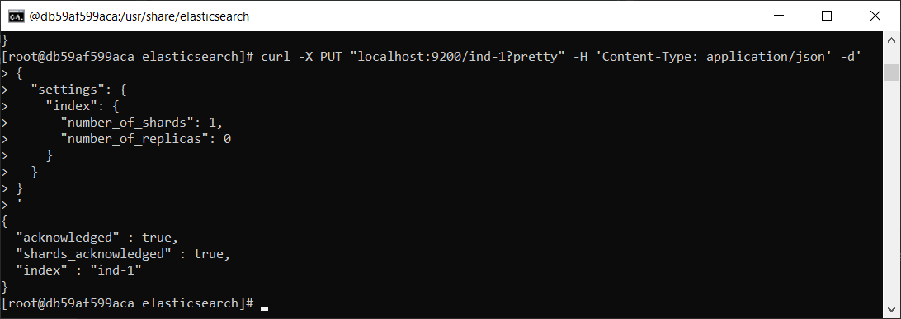
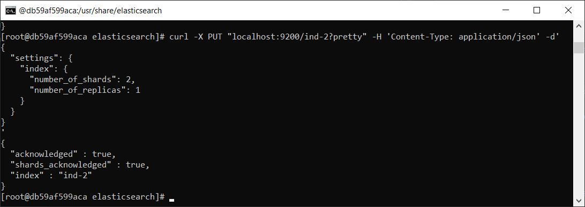
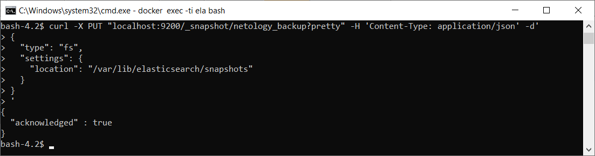

# Домашнее задание к занятию "6.5. Elasticsearch"

## Задача 1

В этом задании вы потренируетесь в:
- установке elasticsearch
- первоначальном конфигурировании elastcisearch
- запуске elasticsearch в docker

Используя докер образ [centos:7](https://hub.docker.com/_/centos) как базовый и 
[документацию по установке и запуску Elastcisearch](https://www.elastic.co/guide/en/elasticsearch/reference/current/targz.html):

- составьте Dockerfile-манифест для elasticsearch
- соберите docker-образ и сделайте `push` в ваш docker.io репозиторий
- запустите контейнер из получившегося образа и выполните запрос пути `/` c хост-машины

Требования к `elasticsearch.yml`:
- данные `path` должны сохраняться в `/var/lib`
- имя ноды должно быть `netology_test`

В ответе приведите:
- текст Dockerfile манифеста
```dockerfile
FROM centos:7
EXPOSE 9200 9300
COPY --chown=root:root elasticsearch.repo /etc/yum.repos.d/
RUN rpm --import https://artifacts.elastic.co/GPG-KEY-elasticsearch
RUN yum upgrade -y && yum install --enablerepo=elasticsearch -y elasticsearch
COPY --chown=root:elasticsearch elasticsearch.yml /etc/elasticsearch/
RUN mkdir /var/lib/elasticsearch/snapshots && chown elasticsearch:elasticsearch /var/lib/elasticsearch/snapshots
USER elasticsearch
ENTRYPOINT [ "/usr/share/elasticsearch/bin/elasticsearch" ]
```
- ссылку на образ в репозитории dockerhub 
  
[Docker Hub](docker.io/urliby/elastic)

- ответ `elasticsearch` на запрос пути `/` в json виде
```yaml
{
  "name" : "netology_test",
  "cluster_name" : "netology",
  "cluster_uuid" : "VLvTmo-AS1ePctnleD2D3w",
  "version" : {
    "number" : "7.13.3",
    "build_flavor" : "default",
    "build_type" : "rpm",
    "build_hash" : "5d21bea28db1e89ecc1f66311ebdec9dc3aa7d64",
    "build_date" : "2021-07-02T12:06:10.804015202Z",
    "build_snapshot" : false,
    "lucene_version" : "8.8.2",
    "minimum_wire_compatibility_version" : "6.8.0",
    "minimum_index_compatibility_version" : "6.0.0-beta1"
  },
  "tagline" : "You Know, for Search"
}
```

Подсказки:
- возможно вам понадобится установка пакета perl-Digest-SHA для корректной работы пакета shasum
- при сетевых проблемах внимательно изучите кластерные и сетевые настройки в elasticsearch.yml
- при некоторых проблемах вам поможет docker директива ulimit
- elasticsearch в логах обычно описывает проблему и пути ее решения

Далее мы будем работать с данным экземпляром elasticsearch.

## Задача 2

В этом задании вы научитесь:
- создавать и удалять индексы
- изучать состояние кластера
- обосновывать причину деградации доступности данных

Ознакомтесь с [документацией](https://www.elastic.co/guide/en/elasticsearch/reference/current/indices-create-index.html) 
и добавьте в `elasticsearch` 3 индекса, в соответствии со таблицей:

| Имя | Количество реплик | Количество шард |
|-----|-------------------|-----------------|
| ind-1| 0 | 1 |
| ind-2 | 1 | 2 |
| ind-3 | 2 | 4 |

```commandline
curl -X PUT "localhost:9200/ind-1?pretty" -H 'Content-Type: application/json' -d'
{
  "settings": {
    "index": {
      "number_of_shards": 1,  
      "number_of_replicas": 0
    }
  }
}
'
```



Получите список индексов и их статусов, используя API и **приведите в ответе** на задание.
```commandline
# curl -X GET "localhost:9200/_cat/indices?pretty"
green  open ind-1           _5mvwRwXRqSTGjrJ0S_9tA 1 0 0 0 208b 208b
green  open my-index-000001 pu1c7uYkRgujEMxrLIm0pA 1 0 0 0 208b 208b
yellow open ind-3           EDvm_4x4TgKu_UCo6m1N_g 4 2 0 0 832b 832b
yellow open ind-2           7hnTjoLqQgiTgP3O3U4-3g 2 1 0 0 416b 416b
```
Получите состояние кластера `elasticsearch`, используя API.
```commandline
[root@db59af599aca elasticsearch]# curl -X GET "localhost:9200/_cluster/health?pretty"
{
  "cluster_name" : "docker-cluster",
  "status" : "yellow",
  "timed_out" : false,
  "number_of_nodes" : 1,
  "number_of_data_nodes" : 1,
  "active_primary_shards" : 8,
  "active_shards" : 8,
  "relocating_shards" : 0,
  "initializing_shards" : 0,
  "unassigned_shards" : 10,
  "delayed_unassigned_shards" : 0,
  "number_of_pending_tasks" : 0,
  "number_of_in_flight_fetch" : 0,
  "task_max_waiting_in_queue_millis" : 0,
  "active_shards_percent_as_number" : 44.44444444444444
```
Как вы думаете, почему часть индексов и кластер находится в состоянии yellow? 

    Статус yellow у индекса обозначает отсутствие реплик(кол-во реплик указано в задании), так как нода у нас одна.

Удалите все индексы.
```commandline
[root@db59af599aca elasticsearch]# curl -X DELETE "localhost:9200/_all?pretty"
{
  "acknowledged" : true
}
```

**Важно**

При проектировании кластера elasticsearch нужно корректно рассчитывать количество реплик и шард,
иначе возможна потеря данных индексов, вплоть до полной, при деградации системы.

## Задача 3

В данном задании вы научитесь:
- создавать бэкапы данных
- восстанавливать индексы из бэкапов

Создайте директорию `{путь до корневой директории с elasticsearch в образе}/snapshots`.
```yaml
#создано при постройке образа
path.repo: /var/lib/elasticsearch/snapshots
```
Используя API [зарегистрируйте](https://www.elastic.co/guide/en/elasticsearch/reference/current/snapshots-register-repository.html#snapshots-register-repository) 
данную директорию как `snapshot repository` c именем `netology_backup`.

**Приведите в ответе** запрос API и результат вызова API для создания репозитория.
```commandline
curl -X PUT "localhost:9200/_snapshot/netology_backup?pretty" -H 'Content-Type: application/json' -d'
{
  "type": "fs",
  "settings": {
    "location": "/var/lib/elasticsearch/snapshots"
  }
}
'
```
*

Создайте индекс `test` с 0 реплик и 1 шардом и **приведите в ответе** список индексов.
```commandline
curl -X PUT "localhost:9200/test?pretty" -H 'Content-Type: application/json' -d'
{
  "settings": {
    "index": {
      "number_of_shards": 1,  
      "number_of_replicas": 0
    }
  }
}
'
bash-4.2$ curl -X GET "localhost:9200/_cat/indices?pretty"
green open test gMiet1z2SRO7ksG4ofMjhQ 1 0 0 0 208b 208b
```

[Создайте `snapshot`](https://www.elastic.co/guide/en/elasticsearch/reference/current/snapshots-take-snapshot.html) 
состояния кластера `elasticsearch`.

**Приведите в ответе** список файлов в директории со `snapshot`ами.
```commandline
bash-4.2$ curl -X PUT "localhost:9200/_snapshot/netology_backup/snapshot_cluster?wait_for_completion=true&pretty"
{
  "snapshot" : {
    "snapshot" : "snapshot_cluster",
    "uuid" : "QgHCZDQxQ4uu48a1may50g",
    "version_id" : 7130399,
    "version" : "7.13.3",
    "indices" : [
      "test"
    ],
    "data_streams" : [ ],
    "include_global_state" : true,
    "state" : "SUCCESS",
    "start_time" : "2021-07-20T08:53:44.119Z",
    "start_time_in_millis" : 1626771224119,
    "end_time" : "2021-07-20T08:53:44.119Z",
    "end_time_in_millis" : 1626771224119,
    "duration_in_millis" : 0,
    "failures" : [ ],
    "shards" : {
      "total" : 1,
      "failed" : 0,
      "successful" : 1
    },
    "feature_states" : [ ]
  }
}

bash-4.2$ ls -la /var/lib/elasticsearch/snapshots/
total 56
drwxr-sr-x 1 elasticsearch elasticsearch  4096 Jul 20 08:53 .
drwxr-s--- 1 elasticsearch elasticsearch  4096 Jul 20 08:20 ..
-rw-r--r-- 1 elasticsearch elasticsearch   511 Jul 20 08:53 index-0
-rw-r--r-- 1 elasticsearch elasticsearch     8 Jul 20 08:53 index.latest
drwxr-sr-x 3 elasticsearch elasticsearch  4096 Jul 20 08:53 indices
-rw-r--r-- 1 elasticsearch elasticsearch 25636 Jul 20 08:53 meta-QgHCZDQxQ4uu48a1may50g.dat
-rw-r--r-- 1 elasticsearch elasticsearch   366 Jul 20 08:53 snap-QgHCZDQxQ4uu48a1may50g.dat
```
Удалите индекс `test` и создайте индекс `test-2`. **Приведите в ответе** список индексов.
```commandline
bash-4.2$ curl -X DELETE "localhost:9200/_all?pretty"
{
  "acknowledged" : true
}
bash-4.2$ curl -X PUT "localhost:9200/test-2?pretty" -H 'Content-Type: application/json' -d'
{
  "settings": {
    "index": {
      "number_of_shards": 1,
      "number_of_replicas": 0
    }
  }
}
'
{
  "acknowledged" : true,
  "shards_acknowledged" : true,
  "index" : "test-2"
}
bash-4.2$ curl -X GET "localhost:9200/_cat/indices?pretty"
green open test-2 md860rXLScOC7lDNg5co7A 1 0 0 0 208b 208b
```
[Восстановите](https://www.elastic.co/guide/en/elasticsearch/reference/current/snapshots-restore-snapshot.html) состояние
кластера `elasticsearch` из `snapshot`, созданного ранее. 

**Приведите в ответе** запрос к API восстановления и итоговый список индексов.
```commandline
bash-4.2$ curl -X POST "localhost:9200/_snapshot/netology_backup/snapshot_cluster/_restore?pretty"
{
  "accepted" : true
}
bash-4.2$ curl -X GET "localhost:9200/_cat/indices?pretty"
green open test-2 md860rXLScOC7lDNg5co7A 1 0 0 0 208b 208b
green open test   7cM68UmITe6KH4HADBz6yw 1 0 0 0 208b 208b
```

Подсказки:
- возможно вам понадобится доработать `elasticsearch.yml` в части директивы `path.repo` и перезапустить `elasticsearch`

---

### Как оформить ДЗ?

Выполненное домашнее задание пришлите ссылкой на .md-файл в вашем репозитории.

---
{"mode":"full","isActive":false}